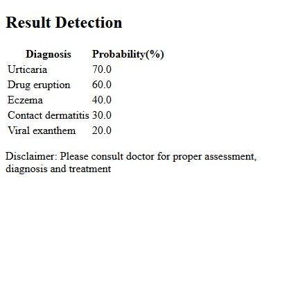

# Flask Gemini AI Wrapper

## Features
- Example how to use Google Gemini AI in python Flask app to detect Skin disease condition and return top 5 diagnosis and probabilities



## Prerequisites
- Python 3.8+
- Flask
- Gemini AI

## Installation

1. Go to https://aistudio.google.com/ and Get API Key. Gemini have free tier API

2. Clone or download this repository:

3. Create a virtual environment (optional but recommended):
   ```sh
   On windows:
   python -m virtualenv venv
   venv\Scripts\activate
   ```
   ```sh
   On linux:
   python3 -m virtualenv venv
   source venv/bin/activate
   ```


4. Install dependencies:
   ```sh
   pip install -r requirements.txt
   ```

## Usage

1. Run the application:
   ```sh
   python app.py
   ```

2. Open your browser and go to:
   ```
   http://127.0.0.1:5000
   ```
